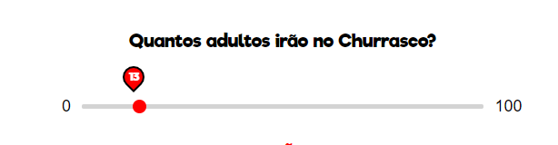
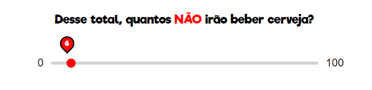
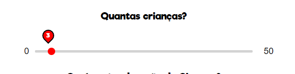
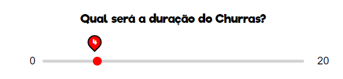
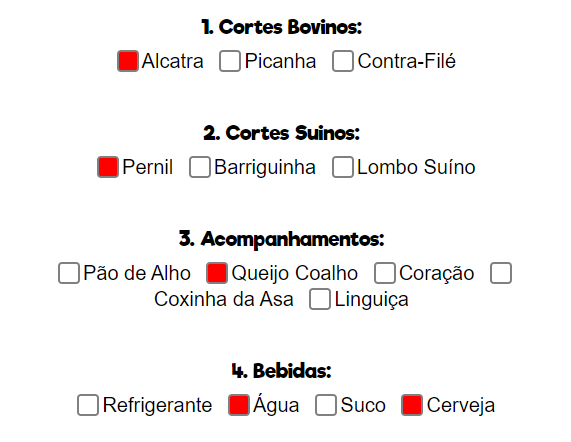
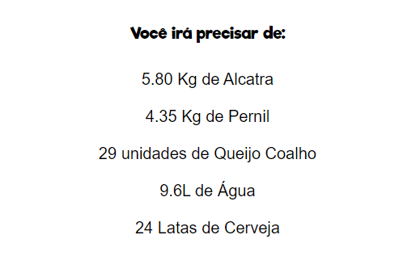

  
  <li> :dart: Um projeto para aqueles que amam churrasco mas não sabem quanto comprar.

   <li> :standing_man: Selecione quantos Adultos irão no seu Churras!
  
    

    

    

  <li> :sparkles: Depois, quantos NÃO irão beber :D 
  
    

     

  <li> :baby: Quantas crianças vão no evento? 
  
    

     

    

  <li> :clock2: Selecione qual vai ser a média de duração do CHURRAS!
  
    

     

    

   <li>Por fim é só selecionar as opções desejadas, e então clicar em CALCULAR
  
    

     

 
  <li>Basta clicar em CALCULAR e apareça na tela a MÉDIA de quanto será necessário comprar de cada item!
  

